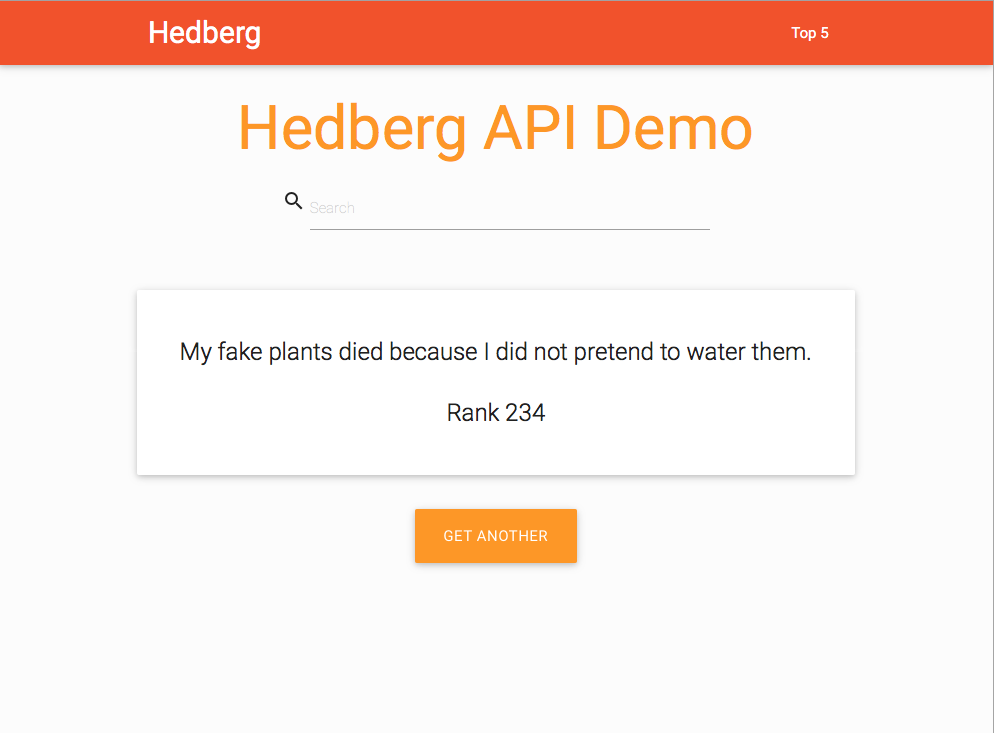

# mitch-hedberg-rest
This app exposes 275 Mitch Hedberg jokes via a RESTful API built using Spring Data REST.

## Start
1. Build and run the app using `./gradlew bootrun` from the root directory
2. Use the HAL browser to traverse the links by visiting <http://localhost:8080/v1/api> in your browser. The API requires authentication. Authenticate using the username "berbigs" and "password" for the password.

## Web UI
The application also provides a web UI that uses the exposed REST API to display jokes. Browse to `http://localhost:8080`. The UI is rendered using Thymeleaf, driven by the `JokeController`. The UI is a single page app using Javascript to make calls to the API and render the responses.

## Technologies Used
- Spring Data REST and Spring Data JPA
- Spring Security
- Spring Boot
- Spring Batch
- H2 Database

